# mapnik-jni-win

## 1. 配置环境

### 1.1 安装Visual Studio，需要选中C++相关的组件

[VS官网](https://visualstudio.microsoft.com/zh-hans/)

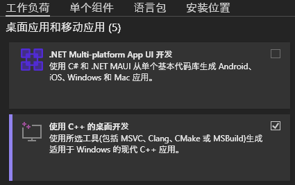

### 1.2 安装Cmake

[CMake官网](https://visualstudio.microsoft.com/zh-hans/)

### 1.3 安装VCPKG

如果没有安装git，需要先安装：[git官网](https://visualstudio.microsoft.com/zh-hans/)

以安装到C盘根目录为例，在命令行中跳转到C盘根目录，并使用如下指令将vcpkg克隆到本地：

```bash
git clone https://github.com/microsoft/vcpkg.git
```

之后使用如下指令下载vcpkg的二进制可执行文件：

```bash
.\vcpkg\bootstrap-vcpkg.bat
```

之后使用如下指令安装本项目的依赖：

```bash
.\vcpkg\vcpkg install mapnik[input-csv,input-gdal,input-geobuf,input-geojson,input-ogr,input-pgraster,input-postgis,input-raster,input-shape,input-sqlite,input-topojson] mapbox-wagyu pkgconf --triplet=x64-windows-static-release
```

如果在`arm64-linux`下使用本项目，则需使用`--triplet=arm64-linux-release`。

安装过程要从GitHub下载文件，所以需要能正常访问GitHub。安装过程比较缓慢(可能几小时)，需要耐心等待。如果出现网络连接相关的错误，重新执行失败的指令即可。

### 1.4 安装JDK，并设置JAVA_HOME环境变量

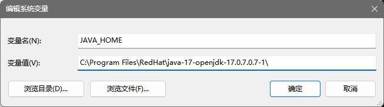

### 1.5 安装VSCode，并安装相关插件

[VSCode下载界面](https://code.visualstudio.com/#alt-downloads)

必装插件：

- [C/C++](https://marketplace.visualstudio.com/items?itemName=ms-vscode.cpptools)
- [CMake](https://marketplace.visualstudio.com/items?itemName=twxs.cmake)
- [CMake Language Support](https://marketplace.visualstudio.com/items?itemName=josetr.cmake-language-support-vscode)
- [CMake Tools](https://marketplace.visualstudio.com/items?itemName=ms-vscode.cmake-tools)
- [Debugger for Java](https://marketplace.visualstudio.com/items?itemName=vscjava.vscode-java-debug)
- [Language Support for Java(TM) by Red Hat](https://marketplace.visualstudio.com/items?itemName=redhat.java)
- [Project Manager for Java](https://marketplace.visualstudio.com/items?itemName=vscjava.vscode-java-dependency)
- [Test Runner for Java](https://marketplace.visualstudio.com/items?itemName=vscjava.vscode-java-test)

可选插件：

- [IntelliCode](https://marketplace.visualstudio.com/items?itemName=VisualStudioExptTeam.vscodeintellicode)
- [indent-rainbow](https://marketplace.visualstudio.com/items?itemName=oderwat.indent-rainbow)
- [Better Comments](https://marketplace.visualstudio.com/items?itemName=aaron-bond.better-comments)
- [Better C++ Syntax](https://marketplace.visualstudio.com/items?itemName=jeff-hykin.better-cpp-syntax)
- [Chinese (Simplified) (简体中文) Language Pack for Visual Studio Code](https://marketplace.visualstudio.com/items?itemName=MS-CEINTL.vscode-language-pack-zh-hans)

### 1.6 克隆本项目

在希望下载本项目的路径打开命令行，并执行如下指令：

```bash
git clone --recursive https://github.com/FredBill1/mapnik-jni-win.git
```

### 1.7 配置本项目

在项目的根目录中打开vscode。

在`.vscode/settings.json`中，将`"cmake.configureArgs"`项中的`"-DCMAKE_TOOLCHAIN_FILE=C:/vcpkg/scripts/buildsystems/vcpkg.cmake"`中的`C:/vcpkg/scripts/buildsystems/vcpkg.cmake`更改为所安装的vcpkg中`vcpkg.cmake`的真实路径。

如果是在`arm64-linux`下，则同时需要将`"-DVCPKG_TARGET_TRIPLET=x64-windows-static-release"`修改为`"-DVCPKG_TARGET_TRIPLET=arm64-linux-release"`，并删除`"-DMAPNIK_JNI_MSVC_USE_STATIC_LINKING=ON"`。

按下`f1`或`ctrl+shift+p`呼出“所有命令”输入框，输入`CMake: Select a Kit`，选择`CMake: 选择工具包`

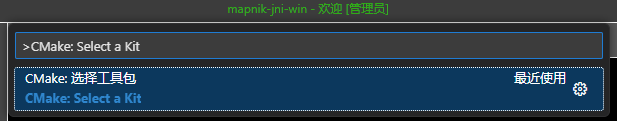

或点击左下角的这个按钮:


之后根据所安装的Visual Studio版本选择对应的后缀为`amd64`的工具包。

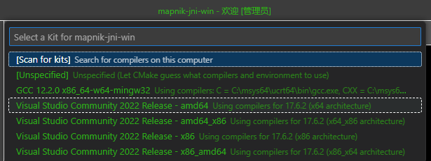

其中，
- `amd64`表示编译器为64位，编译出的程序为64位
- `amd64_x86`表示编译器为64位，编译出的程序为32位
- `x86`表示编译器为32位，编译出的程序为32位
- `x86_amd64`表示编译器为32位，编译出的程序为64位

之后按下`f1`或`ctrl+shift+p`呼出“所有命令”输入框，输入`CMake: Select Variant`，选择`CMake: 选择变量`

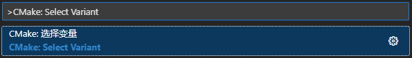

或点击左下角的这个按钮：

![CMake: [Debug] Ready](doc/img/1.7.5.png)

选择`Release`选项

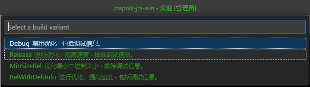

之后按下`f1`或`ctrl+shift+p`呼出“所有命令”输入框，输入`CMake: Configure`，选择`CMake: 配置`

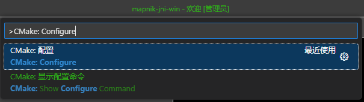

等待VSCode的输出窗口显示类似如下内容，表示配置完成：

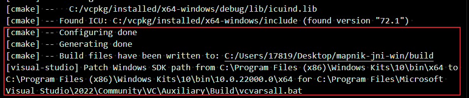

### 1.8 编译本项目

可以尝试按`F7`键或点击下方的这个按钮进行编译：


等待VSCode的输出窗口显示类似如下内容，表示编译成功：

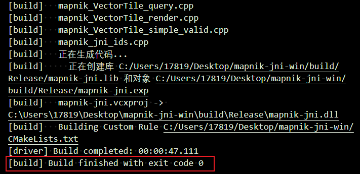

同时会生成`build\mapnik-jni_jar.jar`和`build\Release\mapnik-jni.dll`两个文件。将`mapnik-jni_jar.jar`重命名为`mapnik-jni.jar`后，两个文件就可以用于其它Java项目了。

同时，mapnik自带的字体路径在`C:\vcpkg\installed\x64-windows-static-release\share\mapnik\fonts`

并且，可能需要设置如下环境变量才能正常加载这些文件：

- `GDAL_DATA=C:\vcpkg\installed\x64-windows-static-release\share\gdal`
- `PROJ_LIB=C:\vcpkg\installed\x64-windows-static-release\share\proj`
- `ICU_DATA=C:\vcpkg\installed\x64-windows-static-release\share\icu`

其中`ICU_DATA`的路径好像不包含node-mapnik中对应的`icudt56l.dat`，不清楚是不是不需要这个

## 2. 进行开发

### 2.1 添加、删除源文件和重新配置项目

在`CMakeLists.txt`中使用了如下方式，将所有位于`csrc`文件夹中的`.cpp`文件作为c部分的源文件，所有位于`src`文件夹中的`.java`文件作为java部分的源文件。

```cmake
file(GLOB_RECURSE JAVA_SOURCES src/mapnik/*.java)
add_jar(${PROJECT_NAME}_jar ${JAVA_SOURCES} GENERATE_NATIVE_HEADERS ${PROJECT_NAME}_native)

file(GLOB_RECURSE JNI_SOURCES csrc/*.cpp)
add_library(${PROJECT_NAME} SHARED ${JNI_SOURCES})
```

因此，添加删除源文件只需要在`csrc`和`src`文件夹中添加和删除文件即可。

每次添加、删除源文件，或修改`CMakeLists.txt`的内容后，都需要参考[1.7](#1.7-配置本项目)重新配置CMake缓存，否则C++的代码提示将无法正常工作，且无法进行编译。

### 2.2 为native方法生成对应的头文件

本项目的java源代码编译和jar文件的生成也是用cmake实现的，当java源文件添加或删除了native方法时，可以直接按`F7`重新编译整个项目，也可以直接选择只编译`mapnik-jni_jar`这个target。

可以点击左侧的`CMAKE: 项目大纲`按钮，并点击`mapnik-jni_jar`右侧的生成按钮(鼠标悬浮在上面时才会出现)

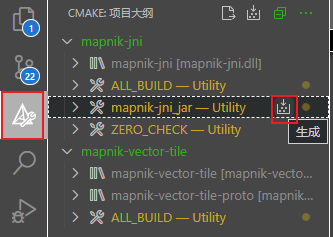

或者按`f1`或`ctrl+shift+p`呼出“所有命令”输入框，输入`CMake: Set Build Target`，选择`CMake: 设置生成目标`；或点击下面的`[ALL_BUILD]`按钮，之后选择`mapnik-jni_jar`，再按`shift+f7`编译`mapnik-jni_jar`目标。

生成的头文件将位于`build\CMakeFiles\mapnik-jni_jar.dir\native_headers`路径中。头文件的包含路径由CMake进行维护，在C++源文件中只需要`#include "mapnik_xxx.h"`即可。

### 2.3 进行测试或调试

用于测试的代码位于`test`文件夹中。这些代码没有使用CMake维护，通过前面安装的VSCode的java插件就可以直接运行测试或调试。

编写的调试代码在打开后左侧会出现这些按钮，可以通过左右键点击来触发相应的运行和调试：

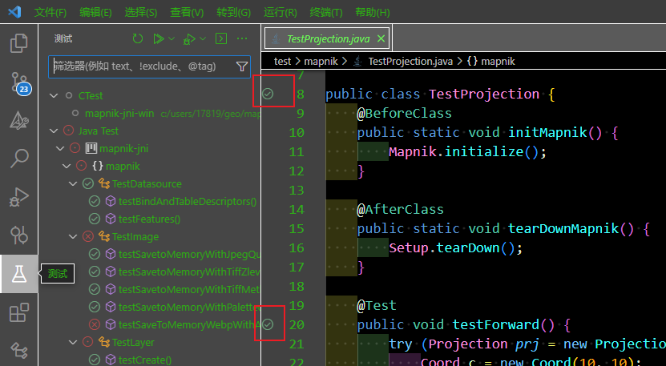

可以执行的main函数上方也会自动出现`Run|Debug`的按钮：

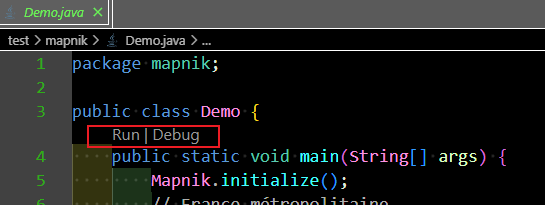

测试时的行为可以在`.vscode\settings.json`文件中进行指定，运行main函数的行为可以在`.vscode\launch.json`文件中进行指定。默认将项目根目录(即`${workspaceFolder}`)设为工作路径，并将`mapnik-jni.dll`所生成在的`build\Release`设为了java检索本地库的路径。

需要注意的是，这样的测试和调试方法不会使用所生成的`mapnik-jni_jar.jar`，而是直接与`src`文件夹中的源文件一起运行，因此修改`src`中的文件时无需重新使用CMake编译，仅当修改了native方法或需要重新生成jar文件时才需要重新使用`F7`进行编译。

更具体的使用VSCode进行调试的方法可以参考[官方文档](https://code.visualstudio.com/docs/editor/debugging)。
